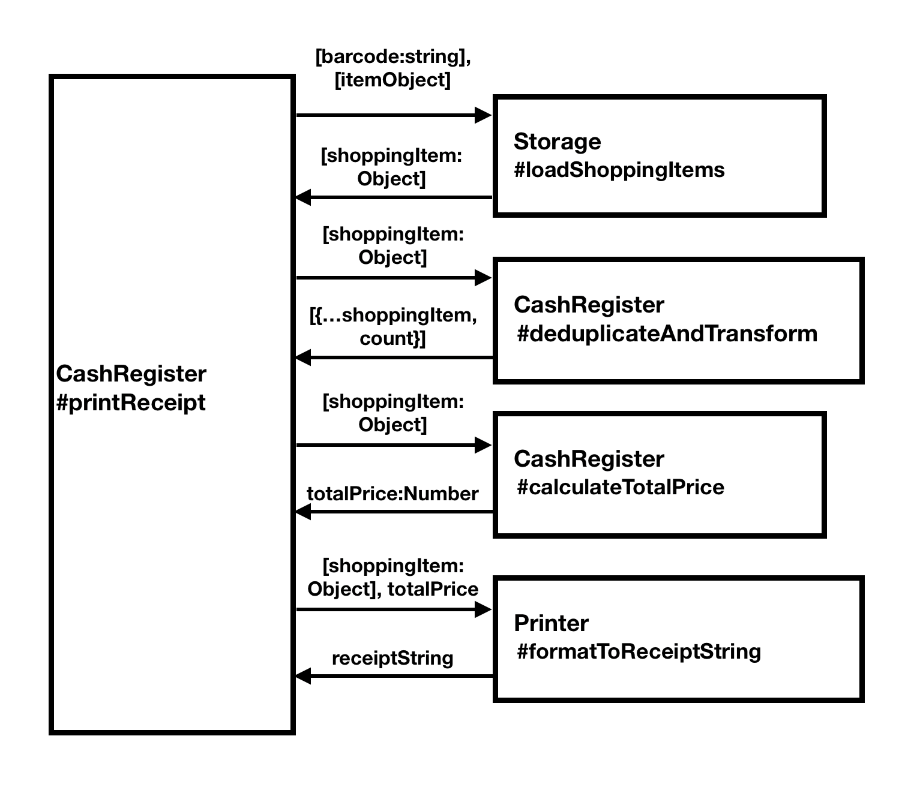

# Requirement
> A cash register (POS) system is used in the store for settlement of the store. This cashier will settle and print the receipt (Receipt) 
according to the item(Item) in the customer's shopping cart (Cart) at the time of settlement.
We need to implement a function called printReceipt, which can input the data of the specified format as a parameter and then output the text of the receipt in the browser console.
This time, the input will be an array of barcodes (string).

For example: 
```For example:
['0001', '0003', '0005', '0003']
```

Suppose that our database is as follows:
```
[
    {"id": "0001", "name" : "Coca Cola", "price": 3},
    {"id": "0002", "name" : "Diet Coke", "price": 4},
    {"id": "0003", "name" : "Pepsi-Cola", "price": 5},
    {"id": "0004", "name" : "Mountain Dew", "price": 6},
    {"id": "0005", "name" : "Dr Pepper", "price": 7},
    {"id": "0006", "name" : "Sprite", "price": 8},
    {"id": "0007", "name" : "Diet Pepsi", "price": 9},
    {"id": "0008", "name" : "Diet Mountain Dew", "price": 10},
    {"id": "0009", "name" : "Diet Dr Pepper", "price": 11},
    {"id": "0010", "name" : "Fanta", "price": 12}
]
```

Then the output should be
```
Receipts
------------------------------------------------------------
Coca Cola                       3          1
Pepsi-Cola                      5          2
Dr Pepper                       7          1
------------------------------------------------------------
Price: 20
```
If an error happened while creating a receipt. This function should return an error message starts with "[ERROR]:"

####Principal
- Please draw task diagrams on a paper.
- Please declare all the methods according to your diagram.
- Please write tests according to the task diagram
- Please repeat step 3 until all functions are implemented.

---

## Task Diagram


## Function Tasking
- 1, Load shopping items
```
input：
    barcodes: [String]
    storeItems: [{
        id: String,
        name: String,
        price: Number
    }]: loadItemsFromStorage()
output：
    shoppingItems: [{
        id: String,
        name: String,
        price: Number
    }]
```
- 2, Deduplicate and transform
```
input：
    shoppingItems
output：
  deduplicatedShoppingItems: [{
        id: String,
        name: String,
        price: Number,
        count: Number
    }]: deduplicateAndTransform()
```
- 3, Calculate total price
```
input：
    shoppingItems
output：
    totalPrice: Number : calculateTotalPrice()
```
- 4, Format to receipt string
```
input：
    deduplicatedShoppingItems, totalPrice
output：
    receiptString: String
```


## Tasking

#### Case 1
- **Given**: an array of unduplicated barcodes.
- **And**:  all ids are matched with items in storages
- **When**: print receipt
- **Then**: should return formatted receipt string with each item’s name & price & count and total price

#### Case 2
- **Given**: an array of duplicated barcodes.
- **And**:  all ids are matched with items in storages
- **When**: print receipt
- **Then**: should return formatted receipt string with each item’s name & price & count and total price
- **And**: all duplicate items will be merged into single item and keep the merged items’ order same with first item’s order

#### Case 3
- **Given**: an array of barcodes.
- **And**:  at least one barcodes does not match a item in storage
- **When**: print receipt
- **Then**: should return error message : “[ERROR]: barcode does not exist”